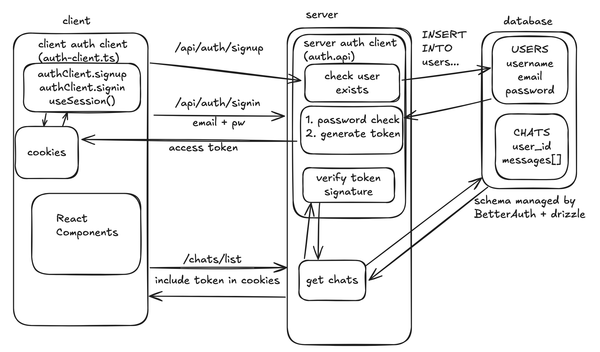

# AI Chatbot

## Overview

This week we're going to build a clone of [chatgpt.com](http://chatgpt.com). It will have
 - A nice chat UI for talking to a model
 - Real-time streaming of AI responses
 - Multiple chats
 - Login (with Google, Github, etc)
 - (Optional) Cool features like search or tool calls (e.g. "get the weather" or "add to my todo list")

I strongly encourage you to make it your own. By using custom prompts and tool calls,
we can make the LLM highly customized. This will make your demo much more fun!
Previous cohorts have have made:
 - a movie recommender bot that remembers past conversations
 - a site that personifies your astrological signs so you can talk to them
 - a trivia game where you talk to characters to learn about new york city
 - a recipes app where the AI can save/generate recipes for you

## Pre-Work

 - [Data vs. State -- The Two Reacts](https://overreacted.io/the-two-reacts/)
 - [Impossible Components](https://overreacted.io/impossible-components/)
  <sub>Note: If these are confusing, also try this talk by Dan Abramov called [React for Two Computers](https://www.youtube.com/watch?v=ozI4V_29fj4&t=2s)</sub>
 - (1 hour) [Next.js App Router Foundations](https://nextjs.org/learn/dashboard-app) and the [Server & Client Components](https://nextjs.org/docs/app/getting-started/server-and-client-components) guide
    - If you already did the Intro to App Router tutorial, skim — spend time on the Server/Client boundary, Route Handlers, and `layout.tsx` nesting
    - The key idea you must walk away with: **everything is a Server Component until you write `"use client"`**
 - (10 min) [Intro to JWTs](https://www.youtube.com/watch?v=Y2H3DXDeS3Q)
    - JWTs are the way we will authenticate users in our app!

## Today's Assignment

For today, we have two goals:
 - set up and understand the Next.js App Router
 - understand authorization and authentication and build it into our app

By the end of the day you should have a Next.js (App Router) app that has a login page
and a page that displays `Hello, {email}!` once the user logs in.

This is deceptively difficult! We need to build:
 - A login page
 - A signup page
 - Store user data permanently in a database with a schema
 - Add logic to make sure users can't access data they're not supposed to
 - Some way to identify users who make random requests to our website

Given how hard and sensitive these problems are, we won't be buliding it from scratch.
We will use an auth framework to do most of the heavy lifting for us.

## Lecture Notes

 - Explain the architecture of the Next.js App Router in a high-level conceptual way
    - file-system routing (`app/` folders → URLs), Server Components vs Client Components, Route Handlers (`route.ts`), `layout.tsx` nesting
 - Talk about authentication / authorization from first principles
 - Talk about what BetterAuth does for us exactly

## Diagram

The auth flow is **framework-agnostic** — the signup/signin → token → cookie → DB dance is identical whether the front door is React Router or Next.js. Study it closely:



What *does* change is how a request gets routed and where server code runs. In React Router (framework mode) a request hit `routes.ts`, ran a route module's `loader`/`action`, and returned. In the **Next.js App Router**, the mapping is:

```
   CLIENT                                  SERVER (Next.js App Router)

   browser                                 app/                       <- file-system IS the router
     │  GET /hello                           └─ hello/
     ▼                                           page.tsx   ← async Server Component
   request ───────────────────────────►          │  (the "loader": await your data here,
     │                                            │   then return JSX — no useLoaderData)
     │  ◄──────── streamed HTML ────────          ▼
     ▼                                         returns rendered RSC
   React hydrates ("use client" islands)

   browser                                 app/api/auth/[...all]/
     │  POST /api/auth/signin  ──────────►    route.ts   ← Route Handler (the "action")
     ▼                                          │  toNextJsHandler(auth) does the work
   authClient.signIn.email()  ◄── Set-Cookie ──┘
```

> Mental model swap: **`loader` → an `async` Server Component**, **`action` → a Route Handler `POST`**, **`useLoaderData()` → the data is just in scope** (the component awaited it), **`<Outlet/>` → `{children}` in `layout.tsx`**. Same kitchen, different tickets.

## Steps

Remember, the goal is **not to copy and paste**. Blindly copying and pasting will keep you from understanding what is going on. 
Make sure you understand every piece of the diagram above. At this point, what we're installing is complex enough that it won't
work exactly right by default, and blindly listening to the AI or red squiggles without a clear understanding of the systems 
at play will lead you down a rabbit hole. Get conceptual understanding of each step first, ideally by asking an LLM.

 - Install Next.js: `bunx create-next-app@latest .`
    - Choose **App Router: Yes**, TypeScript, Tailwind, ESLint. `src/` directory is your call (paths below assume no `src/`).
 - Set up Drizzle and a `db` instance (this is unchanged — Drizzle doesn't care which React framework is in front of it)
 - Install Better Auth
    - Complete steps 1-6 [here](https://www.better-auth.com/docs/installation)
    - We use the [drizzle adapter](https://www.better-auth.com/docs/adapters/drizzle) and [email & password](https://www.better-auth.com/docs/authentication/email-password) configuration. **Note the `nextCookies()` plugin** — it must be last, and it's what lets sign-in set cookies from server code:
```ts
import { betterAuth } from "better-auth";
import { drizzleAdapter } from "better-auth/adapters/drizzle";
import { nextCookies } from "better-auth/next-js";
import { db } from "./db/db";

export const auth = betterAuth({
    emailAndPassword: {
        enabled: true,
    },
    database: drizzleAdapter(db, {
        provider: "pg",
    }),
    plugins: [nextCookies()], // must be the LAST plugin
});
```
 - Generate your schema with Drizzle. After, you should have a `user` table (and a few others) in Supabase.
```bash
bunx @better-auth/cli@latest generate
bun drizzle-kit generate # generate the migration file
bun drizzle-kit migrate # apply the migration
```
 - Now we need to wire Better Auth into **Next.js** (this is the part that replaces the React Router "Remix" integration). Follow the [Next.js integration guide](https://www.better-auth.com/docs/integrations/next).
    - Mount the handler with a **catch-all Route Handler** at `app/api/auth/[...all]/route.ts`:
```ts
import { auth } from "@/lib/auth";
import { toNextJsHandler } from "better-auth/next-js";

export const { GET, POST } = toNextJsHandler(auth);
```
    - check your understanding — what *is* `[...all]`, and why do we need one file to catch `/api/auth/signin`, `/api/auth/signup`, `/api/auth/session`, ... all of them?
    - this is important and easy to miss: without this handler, every `authClient.*` call hits a 404.
 - Create the **client** instance (`lib/auth-client.ts`) — this part is identical to the React Router version, because `authClient` is just a React client:
```ts
import { createAuthClient } from "better-auth/react";

export const authClient = createAuthClient();
```
 - Build signin/signup components using `authClient.signIn.email()` and `authClient.signUp.email()` (these functions are framework-agnostic — same as the RR version)
 - Build a simple sign-in component. Note this is a **Client Component** (`"use client"`) because it uses a hook:
 ```tsx
 "use client";
 import { authClient } from "@/lib/auth-client";

 export default function Home() {
  const { data, isPending, error } = authClient.useSession();
  if (data) {
    return <div>Hello, {data.user.email}!</div>;
  } else {
    return <div>
      <SignIn />
      <SignUp />
    </div>;
  }
}
```
 - If you can see `Hello {email}`, you got everything working!
 - Protect your "Hello {email}" page with a redirect to a separate `/signin` page if they aren't logged in
    - Client-side gate: read `authClient.useSession()` and, when there's no session, send them away with `useRouter().push("/signin")` (from `next/navigation`)

## Optional Extras

 - Start thinking about how to customize this
 - Get [Signup with Google](https://www.better-auth.com/docs/authentication/google) working
 - Protect "Hello {email}" at the **server level**; even trying to GET this page should redirect when logged out. The client-side gate above can be bypassed — do the real check on the server.
    - Turn the page into an `async` **Server Component** and check the session before rendering:
```tsx
import { auth } from "@/lib/auth";
import { headers } from "next/headers";
import { redirect } from "next/navigation";

export default async function ProtectedPage() {
  const session = await auth.api.getSession({ headers: await headers() });
  if (!session) redirect("/signin"); // server-side, can't be skipped
  return <div>Hello, {session.user.email}!</div>;
}
```
    - check your understanding — why is the *server* check the one that actually protects you, and the client check just a UX nicety?
    - Optionally add a `middleware.ts` doing an optimistic cookie check with `getSessionCookie(request)` (from `better-auth/cookies`) to redirect early — but Better Auth recommends the real check stay on the page/route, not middleware.

## Example Code

This week's reference implementation is in **React Router**, on purpose — use it to check your *conceptual* understanding, then translate each piece to the App Router as you go (`loader` → Server Component, `action` → Route Handler, `routes.ts` entry → `app/` folder):

[RR reference PR](https://github.com/fractal-bootcamp/chatbot-react-router/pull/1) · [Better Auth Next.js docs](https://www.better-auth.com/docs/integrations/next)
