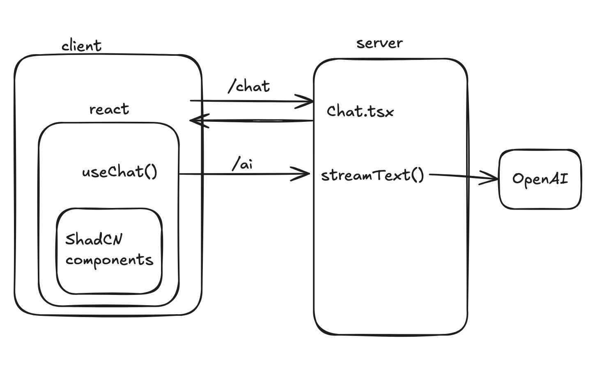

# AI Chatbot: A Single Chat

## Overview

Today, we are going to use the Vercel AI SDK to make a single page where
we can chat with an AI model of our choice. We will have a single 
page, `/chat`, protected by a login page. The chat does not need to persist
between sessions. The page should be nicely styled using ShadCN.

## Pre-Work

 - [Freedom and Responsibility Culture](https://igormroz.com/documents/netflix_culture.pdf)
 - Read the [Foundations](https://ai-sdk.dev/docs/foundations) and [Core Features](https://ai-sdk.dev/docs/ai-sdk-core/overview) of the Vercel AI SDK
 - Learn about [ShadCN](https://ui.shadcn.com/docs)
    - You should be able to clearly answer the question "What is ShadCN and why is it useful to us?"
    - Hint: it is NOT a component library

## Lecture Notes
 - Explain what ShadCN is
 - Explain useChat() and streams
 - Explain the Server Component / Route Handler split: where does the API key live, and why can it never touch the client?

## Diagram



The shape is unchanged: the client's `useChat()` talks to a server endpoint, which calls `streamText()`, which calls your provider. The only translation from the diagram's React-Router labels:

> - `Chat.tsx` (the route that renders the page) → `app/chat/page.tsx`
> - the `/ai` endpoint (a route module `action`) → a **Route Handler** at `app/api/chat/route.ts` exporting `POST`
> - `useChat()` → unchanged, it's a React hook. By default it POSTs to `/api/chat`.

## Steps

 - Most of this day is well explained by [this official tutorial](https://ai-sdk.dev/docs/getting-started/nextjs-app-router) — and good news: **it's written for the Next.js App Router, which is exactly what we're using.** Follow it, but don't follow it blindly.
    - Read every step and make sure you can explain *why* it works, not just *that* it works
    - Use the example code if you get lost
 - [Install dependencies and an AI provider](https://ai-sdk.dev/docs/getting-started/nextjs-app-router#install-dependencies)
    - `bun add ai @ai-sdk/react zod`, plus a provider (I chose [OpenAI](https://ai-sdk.dev/providers/ai-sdk-providers/openai): `bun add @ai-sdk/openai`)
    - you will need to create a developer account and get an API key with your provider, and put it in `.env.local`
 - The [Create Route Handler](https://ai-sdk.dev/docs/getting-started/nextjs-app-router#create-a-route-handler) step:
    - This is the direct equivalent of the React Router `action` you'd have written. In the App Router, a `POST` handler lives in a `route.ts` file. Create `app/api/chat/route.ts`:
```ts
import { openai } from "@ai-sdk/openai";
import { streamText, convertToModelMessages, type UIMessage } from "ai";

export const maxDuration = 30;

export async function POST(req: Request) {
  const { messages }: { messages: UIMessage[] } = await req.json();

  const result = streamText({
    model: openai("gpt-4o-mini"),
    messages: await convertToModelMessages(messages),
  });

  return result.toUIMessageStreamResponse();
}
```
    - check your understanding — there is no `"use client"` in this file. Why is that not just allowed but *required* for the thing holding your API key? (Compare: in RR, `action` only ran on the server for the same reason.)
    - `POST /api/chat` now calls this function.
 - [Wire up your UI to `useChat`](https://ai-sdk.dev/docs/getting-started/nextjs-app-router#wire-up-the-ui)
    - This is your Client Component (`"use client"`). `useChat` collapses what RR split across `<Form>` + `useFetcher` + `useLoaderData` into one hook. Stub:
```tsx
"use client";
import { useChat } from "@ai-sdk/react";
import { useState } from "react";

export default function Chat() {
  const [input, setInput] = useState("");
  const { messages, sendMessage, status } = useChat(); // defaults to POST /api/chat

  return (
    <div>
      {messages.map((m) => (
        <div key={m.id}>
          {m.role}: {m.parts.map((p, i) =>
            p.type === "text" ? <span key={i}>{p.text}</span> : null
          )}
        </div>
      ))}
      {/* TODO: a form that calls sendMessage({ text: input }) and clears input */}
      {/* TODO: disable input while status !== "ready" */}
    </div>
  );
}
```
    - Note: a message is an ordered array of `parts`, not a string. You `switch` on `part.type`. (This is why tools "just work" later without rewriting your render loop.)
 - Get the AI to use a single tool, perhaps [to get the weather](https://ai-sdk.dev/docs/ai-sdk-core/tools-and-tool-calling) — add a `tools: { ... }` object to `streamText`, and render the `tool-weather` part type in the UI
 - [Install a button via shadcn](https://ui.shadcn.com/docs/installation)
 - Peruse a list of component libraries that use ShadCN [here](https://github.com/birobirobiro/awesome-shadcn-ui) and pick one you'd like to use or modify for your project
 - Re-style your chat page using your fancy pretty shadcn components
 - Protect `/chat` behind a login of some kind. **Don't forget that `POST /api/chat` should be protected too!**
    - Page-level: make `app/chat/page.tsx` a Server Component that checks `auth.api.getSession({ headers: await headers() })` and `redirect("/signin")` if absent, then renders your `"use client"` `<Chat />`
    - Endpoint-level: at the top of your `POST` handler, check the session and bail (e.g. `return new Response("Unauthorized", { status: 401 })`) before calling `streamText`. A logged-out `curl` to `/api/chat` must not reach your provider.

## Optional Extras

 - Start evolving your project into something exciting to demo!
 - Add even more styling
 - Add more tool calls
 - Set up a cool custom [prompt](https://ai-sdk.dev/docs/ai-sdk-core/prompt-engineering) (pass `system: "..."` to `streamText`)

## Example Code

[RR reference PR](https://github.com/fractal-bootcamp/chatbot-react-router/pull/2) (translate it) · [AI SDK Next.js quickstart](https://ai-sdk.dev/docs/getting-started/nextjs-app-router)
