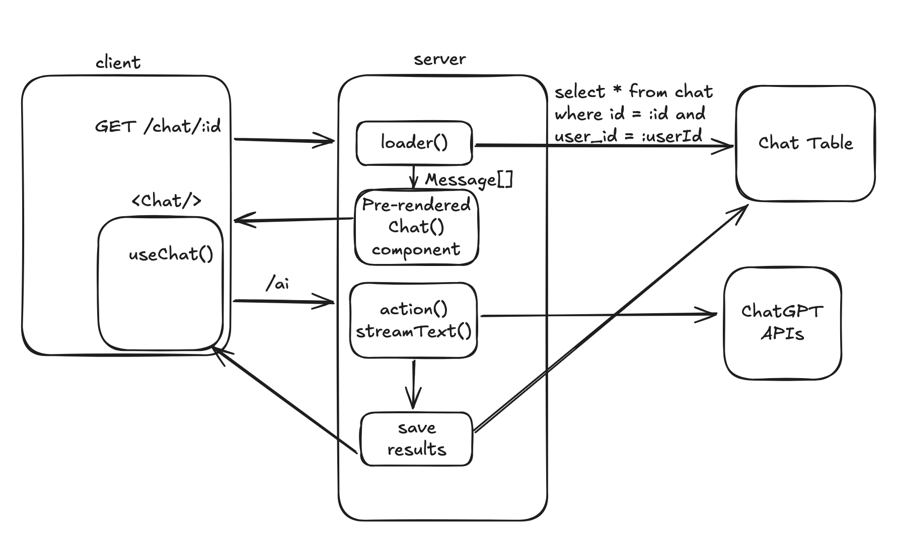

# AI Chatbot: Persistence + Multiple Chats

## Overview

Today, we are going to support storing and listing multiple chats for a single user.
By the end of the day, we should have a very bare-bones clone of ChatGPT, with:

 - A sidebar with a list of chats and a "new chat" button
 - Different chats accessible by ID, e.g. `/chat/{id}`
 - Users don't see each other's chats
 - Chats are saved between sessions

## Pre-Work

 - [Ch3. Data, Actions, Calculations](https://drive.google.com/file/d/1NQ3CXC1cPlgdoegeCbA01tGUWVUDPbqA/view)
 - [Copy What You Like](https://paulgraham.com/copy.html)

## Diagram



Translating the diagram's React-Router labels into the App Router:

> - `GET /chat/:id` → a **dynamic route**: `app/chat/[id]/page.tsx`
> - `loader()` reading `select * from chat where id = :id and user_id = :userId` → that query lives *directly inside* the `async` Server Component (`page.tsx`). It awaits the DB and passes the `Message[]` down as a prop. **There is no `loader` export and no `useLoaderData`** — the data is just in scope.
> - "Pre-rendered Chat() component" → your Server Component renders the `"use client"` `<Chat initialMessages={...} />`
> - `action()` / `streamText()` / "save results" → the `POST /api/chat` Route Handler streams, and saves on completion via `onFinish`
> - The scoping `and user_id = :userId` is the whole ballgame for "users don't see each other's chats" — derive `userId` from the session **on the server**, never trust it from the client.

## Steps

 - Create a table and schema for each chat
    - This is a bit tricky. What _is_ a chat? What can it contain?
    - One trick to help modeling: figure out exactly how you need to read/write data to your database. Write those functions first
    - Should you store each chat as a single row? Or perhaps each message has its own row? What's the tradeoff?
 - Set up your database functions: create/read/update/list chats
    - Every read/list function should take a `userId` and filter on it. This is your authorization boundary — bake it into the query, not the UI.
 - Add a "Create Chat" button that creates a new chat and redirects to `/chat/{newId}`
    - The clean App Router way is a **Server Action**: a function marked `"use server"` that inserts the row and then calls `redirect("/chat/" + newId)` (from `next/navigation`). Stub:
```tsx
// app/actions.ts
"use server";
import { redirect } from "next/navigation";
import { auth } from "@/lib/auth";
import { headers } from "next/headers";

export async function createChat() {
  const session = await auth.api.getSession({ headers: await headers() });
  if (!session) redirect("/signin");
  const chat = await db.createChat(session.user.id); // your db fn
  redirect(`/chat/${chat.id}`);
}
```
    - check your understanding — in RR this was an `action` returning a `redirect()`. What's the same here, and what's different about *who calls it* (a `<form action={createChat}>` vs an RR `<Form>`)?
 - Load a chat's history in the dynamic route. `app/chat/[id]/page.tsx` is your `loader`:
```tsx
import { auth } from "@/lib/auth";
import { headers } from "next/headers";
import { redirect, notFound } from "next/navigation";
import { Chat } from "./chat"; // your "use client" component

export default async function ChatPage({
  params,
}: {
  params: Promise<{ id: string }>; // Next 15+: params is a Promise — await it
}) {
  const { id } = await params;
  const session = await auth.api.getSession({ headers: await headers() });
  if (!session) redirect("/signin");

  const chat = await db.getChat(id, session.user.id); // scoped by user!
  if (!chat) notFound();

  return <Chat chatId={id} initialMessages={chat.messages} />;
}
```
 - [Set up message persistence](https://ai-sdk.dev/docs/ai-sdk-ui/chatbot-message-persistence)
    - This tutorial has good _ideas_ but you shouldn't follow it line for line at all times
    - The two hooks that matter: seed the client with `initialMessages` from the Server Component above, and **save on the server** in `streamText`'s `onFinish` callback inside your `POST /api/chat` handler. Sketch:
```ts
const result = streamText({
  model: openai("gpt-4o-mini"),
  messages: await convertToModelMessages(messages),
  onFinish: async ({ responseMessages }) => {
    // persist the new turn(s) here, scoped to chatId + userId
    // (confirm the exact callback field name against the docs for your installed SDK version)
  },
});
```
    - check your understanding — why save in `onFinish` on the server rather than from the client after the stream ends? (Hint: what happens if the user closes the tab mid-stream?)
 - Add a chat sidebar that lists all the chats
    - This is shared chrome across every `/chat/*` page → it belongs in a `layout.tsx` at `app/chat/layout.tsx`, with `{children}` where the active chat renders (this is the App Router's `<Outlet/>`). The sidebar itself can be an `async` Server Component that lists the user's chats.

## Lecture Notes

 - Chat modelling exercise
 - Order of implementing things. What should go first?
 - `layout.tsx` + `{children}` as the replacement for nested routes + `<Outlet/>`

## Example Code

[RR reference PR](https://github.com/fractal-bootcamp/chatbot-react-router/pull/3) (translate it) · [AI SDK message persistence](https://ai-sdk.dev/docs/ai-sdk-ui/chatbot-message-persistence)
